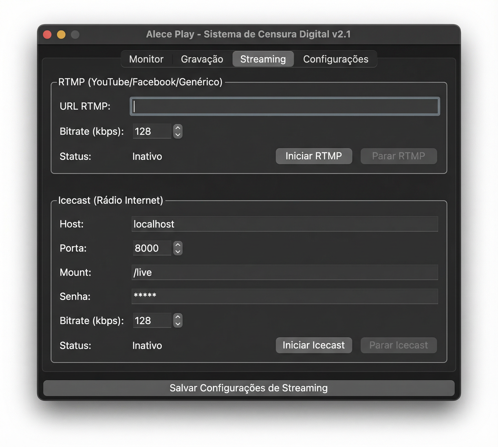

# Alece Play - Guia de Uso do Sistema de Censura Digital

> Sistema de gravação contínua de áudio para rádio com streaming ao vivo (RTMP/Icecast), processamento automático e interface gráfica intuitiva.

---

## Sumário

1. [Requisitos](#1-requisitos)
2. [Instalação](#2-instalação)
3. [Primeiro Uso](#3-primeiro-uso)
4. [Tela Monitor](#4-tela-monitor)
5. [Tela Gravação](#5-tela-gravação)
6. [Tela Streaming](#6-tela-streaming)
7. [Tela Configurações](#7-tela-configurações)
8. [Processador de Gravações](#8-processador-de-gravações)
9. [Arquivo de Configuração](#9-arquivo-de-configuração)
10. [Uso via Linha de Comando](#10-uso-via-linha-de-comando)
11. [Processamento Automático Diário](#11-processamento-automático-diário)
12. [Watchdog e Monitoramento](#12-watchdog-e-monitoramento)
13. [Build para Windows (Executável)](#13-build-para-windows-executável)
14. [Solução de Problemas](#14-solução-de-problemas)

---

## 1. Requisitos

### Software

| Requisito | Detalhes |
|-----------|----------|
| **Python** | 3.9 ou superior |
| **FFmpeg** | Necessário para streaming e conversão WAV→MP3. Deve estar no PATH do sistema. |
| **PortAudio** | Necessário para captura de áudio (instalado automaticamente com PyAudio/sounddevice). |

### Dependências Python

| Pacote | Função |
|--------|--------|
| `PyAudio` | Captura de áudio (principal no macOS/Linux) |
| `sounddevice` | Captura de áudio (preferido no Windows) |
| `numpy` | Processamento numérico de áudio |
| `tkcalendar` | Calendário visual no Processador |
| `Pillow` | Exibição do logo na interface |

### Compatibilidade de Plataformas

| Plataforma | Status |
|------------|--------|
| **macOS** | Totalmente compatível |
| **Windows** | Totalmente compatível (com fallback automático para sounddevice) |
| **Linux** | Totalmente compatível |

---

## 2. Instalação

### macOS

```bash
# Instalar PortAudio (necessário para PyAudio)
brew install portaudio ffmpeg

# Clonar o projeto e instalar dependências
cd YouStream-RadioSuite
pip install -r requirements.txt
```

### Windows

```bat
REM Instalar FFmpeg: baixe de https://ffmpeg.org/download.html e adicione ao PATH
REM Instalar Python de https://python.org (marcar "Add Python to PATH")

cd YouStream-RadioSuite
pip install -r requirements.txt
```

> **Dica Windows:** Se `PyAudio` falhar na instalação, instale `sounddevice` como alternativa:
> ```
> pip install sounddevice
> ```

### Linux (Ubuntu/Debian)

```bash
sudo apt install portaudio19-dev python3-pyaudio python3-tk ffmpeg
pip install -r requirements.txt
```

---

## 3. Primeiro Uso

### Iniciar a Interface

```bash
python interface_censura_digital.py
```

Ou use o launcher (verifica dependências automaticamente):

```bash
python launch_interface.py
```

### Configuração Inicial

1. Copie o arquivo de exemplo para criar sua configuração:
   ```bash
   cp config_censura_exemplo.json config_censura.json
   ```
2. Abra o programa e vá para a aba **Configurações**
3. Selecione o **dispositivo de áudio** correto (mesa de som, placa de áudio, etc.)
4. Escolha o **diretório de saída** para as gravações
5. Clique em **Aplicar e Salvar Configurações**

---

## 4. Tela Monitor


A tela **Monitor** é o painel principal que exibe o estado geral do sistema em tempo real.

### Elementos da Tela

| Elemento | Descrição |
|----------|-----------|
| **Logo Alece Play** | Logo do sistema no topo |
| **Nível de Áudio (VU Meter)** | Barra horizontal com escala dBFS (-60 a 0 dB). Verde = nível normal, Amarelo = nível alto (-12 dB), Vermelho = próximo ao clipping (-3 dB) |
| **Semáforo Gravação** | Círculo indicador: **Cinza** = inativo, **Vermelho** = gravando normalmente, **Amarelo** = gravando com alertas (stalls) |
| **Semáforo RTMP** | **Cinza** = inativo, **Verde** = pronto (gravação ativa), **Vermelho** = ON AIR (streaming ativo), **Amarelo** = erro |
| **Semáforo Icecast** | Mesma lógica do RTMP |
| **Autostart** | Checkbox para iniciar gravação automaticamente ao abrir o programa |
| **Alertas** | Mensagens do watchdog (stalls, reinícios automáticos) |

### Indicadores de Estado dos Semáforos

- **INATIVO** — Nenhum processo em andamento
- **PRONTO** — Gravação ativa, streaming pode ser iniciado
- **GRAVANDO / ON AIR** — Processo ativo (semáforo vermelho)
- **ALERTA** — Stall detectado pelo watchdog (semáforo amarelo)
- **ERRO** — Falha no streaming (semáforo amarelo)

---

## 5. Tela Gravação


A aba **Gravação** controla a captura de áudio e o monitoramento.

### Como Usar

1. Clique em **Iniciar Gravação** para começar a gravar
2. O status mudará para "Gravando chunk #1..."
3. O áudio é dividido automaticamente em chunks de 15 minutos (configurável)
4. Clique em **Parar Gravação** quando quiser encerrar

### Controles

| Controle | Função |
|----------|--------|
| **Iniciar Gravação** | Inicia a captura de áudio do dispositivo selecionado |
| **Parar Gravação** | Encerra a gravação e salva o chunk atual |
| **Processar Gravações Antigas...** | Abre a janela do Processador (converter WAV→MP3) |
| **Ouvir o que está sendo gravado** | Ativa retorno de áudio em tempo real (monitor) |
| **Volume** | Controla o volume do retorno (0.0 a 1.5x) |
| **Saúde da Gravação** | Mostra informações do watchdog |

### Organização dos Arquivos

As gravações são salvas automaticamente na estrutura:

```
gravacoes_radio/
└── 2026/
    ├── 03-01/
    │   ├── radio_20260301_080000.wav
    │   ├── radio_20260301_081500.wav
    │   └── ...
    └── 03-02/
        ├── radio_20260302_080000.wav
        └── ...
```

Cada chunk é nomeado com o prefixo `radio_` seguido da data e hora de início.

---

## 6. Tela Streaming



A aba **Streaming** permite enviar o áudio ao vivo para servidores RTMP e/ou Icecast simultaneamente, **sem necessidade de software externo como OBS**.

### RTMP (YouTube Live, Facebook Live, etc.)

1. Cole a **URL RTMP** do seu serviço (ex: `rtmp://a.rtmp.youtube.com/live2/sua-chave`)
2. Ajuste o **Bitrate** (128 kbps é o padrão)
3. **Inicie a gravação primeiro** na aba Gravação
4. Clique em **Iniciar RTMP**
5. O semáforo RTMP ficará vermelho (**ON AIR**)

> O áudio é codificado em AAC e enviado no formato FLV via FFmpeg.

### Icecast (Rádio Internet)

1. Preencha os dados do servidor:
   - **Host**: endereço do servidor Icecast (ex: `radio.exemplo.com`)
   - **Porta**: porta do servidor (padrão: `8000`)
   - **Mount**: ponto de montagem (ex: `/live`)
   - **Senha**: senha do source do Icecast
2. Ajuste o **Bitrate** (128 kbps é o padrão)
3. **Inicie a gravação primeiro** na aba Gravação
4. Clique em **Iniciar Icecast**

> O áudio é codificado em MP3 (libmp3lame) e enviado ao servidor Icecast.

### Salvar Configurações

Clique em **Salvar Configurações de Streaming** para persistir as URLs, host, porta e bitrate no arquivo `config_censura.json`.

> **Importante:** A gravação deve estar ativa para iniciar qualquer streaming. Os streamings RTMP e Icecast podem funcionar simultaneamente.

---

## 7. Tela Configurações


A aba **Configurações** permite ajustar o dispositivo de áudio e o local de armazenamento.

### Dispositivo de Gravação

1. O **dropdown** lista todos os dispositivos de entrada detectados
2. Clique em **Atualizar** para recarregar a lista (útil após conectar um novo dispositivo)
3. Ao selecionar um dispositivo, os detalhes são exibidos:
   - **Canais de Entrada**: número de canais disponíveis
   - **Canais de Saída**: número de canais de saída
   - **Taxa Padrão**: sample rate do dispositivo (ex: 44100 Hz)

### Diretório de Saída

- O campo mostra o diretório atual onde as gravações são salvas
- Clique em **Procurar...** para escolher outro local
- O padrão é `gravacoes_radio` (relativo ao diretório do programa)

### Aplicar Configurações

Clique em **Aplicar e Salvar Configurações** para salvar tudo no arquivo `config_censura.json`.

> **Nota:** As configurações de dispositivo não podem ser alteradas durante uma gravação. A aba fica desabilitada enquanto a gravação está ativa.

---

## 8. Processador de Gravações


O **Processador de Gravações** converte arquivos WAV em MP3 e permite extrair trechos específicos. Acesse pela aba **Gravação** → **Processar Gravações Antigas...**

### Processar Dia Completo

1. Selecione a **data** no calendário
2. Marque **Manter arquivos MP3 após compactar** se desejar manter os MP3 individuais além do ZIP
3. Clique em **Processar Gravações da Data Selecionada**
4. O progresso é exibido na área de texto inferior

O processamento:
- Converte todos os WAVs do dia para MP3 (bitrate configurável, padrão 128 kbps)
- Compacta os MP3s em um arquivo ZIP
- Remove os WAVs originais (opcional, configurável)

### Extrair Trecho Específico

Para extrair um intervalo de tempo específico (ex: uma matéria ou entrevista):

1. Preencha **Início** e **Fim** no formato `AAAA-MM-DD HH:MM:SS`
   - Exemplo: `2026-03-02 09:30:00` até `2026-03-02 10:15:00`
2. Clique em **Extrair Intervalo**
3. O sistema identifica os chunks WAV necessários, concatena e recorta o trecho solicitado

> O trecho extraído é salvo como um arquivo MP3 na pasta de saída.

---

## 9. Arquivo de Configuração

O arquivo `config_censura.json` contém todas as configurações do sistema. Para criar o seu, copie o modelo:

```bash
cp config_censura_exemplo.json config_censura.json
```

### Estrutura Completa

```json
{
  "audio": {
    "format": "paInt16",
    "channels": 1,
    "rate": 44100,
    "chunk_size": 1024,
    "device_index": null
  },
  "recording": {
    "chunk_duration_minutes": 15,
    "output_directory": "gravacoes_radio",
    "filename_prefix": "radio",
    "max_chunks_per_day": 96
  },
  "processing": {
    "mp3_bitrate_kbps": 128,
    "ffmpeg_path": "ffmpeg",
    "ffmpeg_threads": 1,
    "delete_wav_after_days": 1,
    "process_priority": "low"
  },
  "streaming": {
    "rtmp": {
      "enabled": false,
      "url": "rtmp://servidor/live/chave_de_stream",
      "audio_bitrate_kbps": 128
    },
    "icecast": {
      "enabled": false,
      "host": "localhost",
      "port": 8000,
      "mount": "/live",
      "source_password": "senha_icecast",
      "audio_bitrate_kbps": 128
    }
  },
  "interface": {
    "autostart_recording": false
  },
  "logging": {
    "log_file": "censura_digital.log",
    "log_level": "INFO"
  }
}
```

### Descrição dos Campos

| Seção | Campo | Descrição |
|-------|-------|-----------|
| `audio` | `device_index` | Índice do dispositivo de áudio. Use `null` para o padrão do sistema. |
| `audio` | `channels` | 1 (mono) ou 2 (estéreo) |
| `audio` | `rate` | Taxa de amostragem: 44100 (FM), 22050 (AM), 48000 (alta qualidade) |
| `audio` | `chunk_size` | Tamanho do buffer (padrão: 1024) |
| `recording` | `chunk_duration_minutes` | Duração de cada arquivo WAV (padrão: 15 min) |
| `recording` | `output_directory` | Pasta onde as gravações são salvas |
| `recording` | `filename_prefix` | Prefixo dos nomes de arquivo |
| `recording` | `max_chunks_per_day` | Limite de chunks por dia (96 = 24h com chunks de 15min) |
| `processing` | `mp3_bitrate_kbps` | Qualidade do MP3 (64-320 kbps) |
| `processing` | `ffmpeg_path` | Caminho do FFmpeg (ou "ffmpeg" se estiver no PATH) |
| `processing` | `delete_wav_after_days` | Dias para manter WAVs antes de apagar automaticamente |
| `processing` | `process_priority` | Prioridade do processo: "low" (recomendado) ou "normal" |
| `streaming.rtmp` | `url` | URL completa do servidor RTMP |
| `streaming.icecast` | `host`, `port`, `mount` | Dados de conexão do servidor Icecast |
| `interface` | `autostart_recording` | Iniciar gravação automaticamente ao abrir |
| `logging` | `log_level` | Nível de log: DEBUG, INFO, WARNING, ERROR |

### Perfis de Qualidade Sugeridos

| Perfil | Sample Rate | Canais | Chunk (min) | Uso |
|--------|-------------|--------|-------------|-----|
| Rádio FM | 44100 | 2 | 15 | Qualidade padrão para FM |
| Rádio AM | 22050 | 1 | 30 | Economia de espaço para AM |
| Alta Qualidade | 48000 | 2 | 15 | Máxima fidelidade |

---

## 10. Uso via Linha de Comando

Para gravar sem a interface gráfica:

```bash
# Gravação simples
python gravador_censura_digital.py

# Listar dispositivos de áudio
python gravador_censura_digital.py --list-devices

# Monitorar áudio em tempo real
python gravador_censura_digital.py --monitor

# Usar configuração alternativa
python gravador_censura_digital.py --config outro_config.json
```

### Teste de Dispositivo

```bash
python teste_censura_digital.py
```

O script lista os dispositivos disponíveis e oferece um teste de gravação de 10 segundos.

---

## 11. Processamento Automático Diário

O sistema executa automaticamente às **00:05** de cada dia:

1. Converte os WAVs do dia **anterior** para MP3
2. Compacta em ZIP
3. Remove WAVs antigos (conforme `delete_wav_after_days`)

Isso acontece em background, sem interromper a gravação em andamento.

---

## 12. Watchdog e Monitoramento

O sistema inclui um **watchdog** que monitora a saúde da captura de áudio:

- Detecta quando o dispositivo para de enviar dados (**stall**) por mais de 10 segundos
- Tenta **reiniciar o stream** de entrada automaticamente (até 5 tentativas)
- Exibe alertas na interface em tempo real (semáforo amarelo)
- Registra todos os eventos no arquivo de log

O status do watchdog é visível na aba **Gravação** (campo "Saúde da Gravação") e na aba **Monitor** (semáforo + alertas).

---

## 13. Build para Windows (Executável)

Para distribuir a aplicação sem exigir instalação de Python:

### Gerar o Executável

```bat
REM No Windows, com o ambiente configurado:
build_windows.bat
```

Ou manualmente:

```bat
venv\Scripts\pip install -r requirements.txt -r requirements-build.txt
venv\Scripts\python -m PyInstaller build_windows.spec --noconfirm --clean
```

### Resultado

A pasta `dist\CensuraDigital\` conterá:
- `CensuraDigital.exe` — executável principal
- `config_censura_exemplo.json` — modelo de configuração
- DLLs e dependências necessárias

### Distribuição

1. Compacte a pasta `dist\CensuraDigital\` em um ZIP
2. O usuário final precisa apenas:
   - Extrair o ZIP
   - Ter **FFmpeg no PATH**
   - Copiar `config_censura_exemplo.json` → `config_censura.json` e editar
   - Executar `CensuraDigital.exe`

---

## 14. Solução de Problemas

### Problema: "PyAudio travou" ou timeout ao abrir

**No Windows:** O PyAudio pode travar com certos drivers. O sistema automaticamente usa `sounddevice` como alternativa.

```bash
pip install sounddevice
```

### Problema: "FFmpeg não encontrado"

O FFmpeg precisa estar no PATH do sistema.

- **macOS:** `brew install ffmpeg`
- **Windows:** Baixe de [ffmpeg.org](https://ffmpeg.org/download.html) e adicione ao PATH
- **Linux:** `sudo apt install ffmpeg`

### Problema: "Nenhum dispositivo de áudio"

1. Verifique se a placa de áudio está conectada
2. Na aba Configurações, clique em **Atualizar**
3. Teste com: `python teste_censura_digital.py`

### Problema: Streaming RTMP não conecta

1. Verifique se a URL RTMP está correta e completa (incluindo a chave)
2. Certifique-se de que o FFmpeg tem suporte a AAC
3. Verifique conectividade de rede

### Problema: Streaming Icecast não conecta

1. Verifique host, porta, mount e senha
2. Certifique-se de que o servidor Icecast está rodando e acessível
3. O FFmpeg precisa de `libmp3lame` (builds oficiais já incluem)

### Problema: Stalls frequentes (semáforo amarelo)

1. Pode indicar problema com o dispositivo de áudio ou driver
2. Tente selecionar outro dispositivo
3. Verifique se o dispositivo não está em uso por outro programa
4. O watchdog tentará reiniciar automaticamente até 5 vezes

### Logs

Todos os eventos são registrados em `censura_digital.log`. Para mais detalhes, altere o nível de log para `DEBUG` no arquivo de configuração.

---

> **Alece Play** — Desenvolvido por Rodrigo Lima
